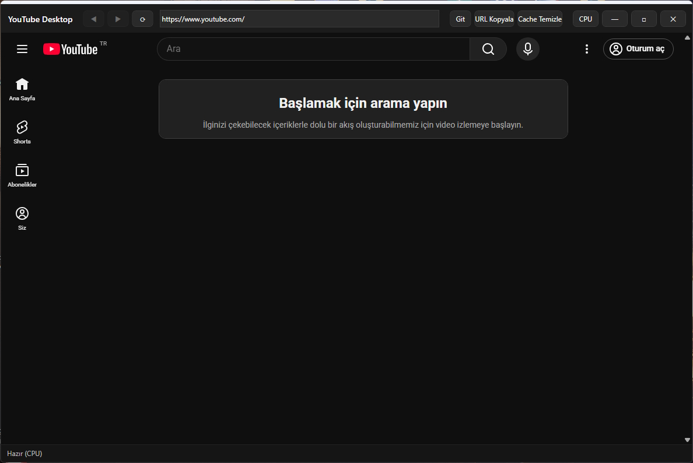
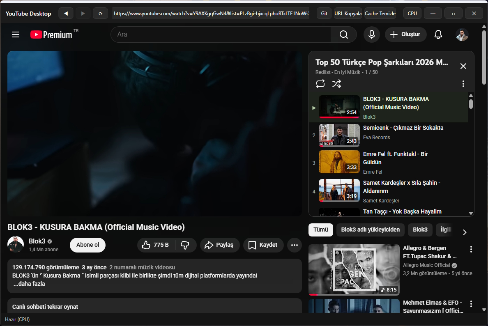

# YouTube Desktop Player (Portable Desktop YouTube Client)

Bu proje, **Euro Truck Simulator 2** (veya benzer GPU yoğun oyunlar) oynarken tarayıcı üzerinden YouTube kullanıldığında yaşanan **takılma, donma ve ses kesilmelerini** azaltmak amacıyla geliştirilmiştir.

Oyun GPU’yu %100 kullanırken tarayıcı da video oynatmak için GPU’dan kaynak talep ettiğinde sistem zorlanabilir. Bu uygulama, video oynatımını **CPU üzerinden** gerçekleştirerek GPU’daki yükü azaltmayı ve sorunsuz bir şekilde video izlemenizi sağlamayı hedefler.

> 🎯 **Tamamen taşınabilir (Portable)** — Kurulum gerektirmez! İndir, çalıştır, kullan.

---

## ✨ Özellikler

- **Taşınabilir (Portable) Çalışma:** Kurulum gerektirmez. Tek bir `.exe` dosyası ile çalışır. USB bellekten bile kullanılabilir.
- **Yerel YouTube Tarayıcısı:** Uygulama açıldığında doğrudan YouTube ana sayfasını yükler.
- **Hesap Entegrasyonu:** Google hesabınızla giriş yaparak kütüphanenize, çalma listelerinize ve aboneliklerinize erişebilirsiniz.
- **CPU/GPU Donanım İvme Değiştirici (Killer Özellik):**
  - Uygulama içindeki buton sayesinde videoların işlenmesi için kullanılan donanım kaynağını anlık olarak değiştirebilirsiniz.
  - **GPU Modu:** Varsayılan performans modu.
  - **CPU Modu:** Oyun oynarken aktifleştirmeniz gereken mod. Video oynatımını grafik kartı yerine işlemci üzerinden yaparak oyunun GPU’yu tamamen ele geçirmesine izin verir; böylece takılmaların önüne geçer.
- **Hafif Arayüz:** Sistem tepsisinde rahatça çalışır, oyununuzu bölmez.

---

## 📸 Ekran Görüntüleri

>  

---

## 🚀 Başlarken

### Gereksinimler

- **Windows 10 / 11** (test edilmiştir)
- **.NET** (projenin hedef sürümüne bağlıdır — örn: `.NET 6/7/8` veya `.NET Framework 4.7.2+`)
- **WebView2 Runtime**
  - Genelde Windows 11’de yüklü gelir.
  - Yüklü değilse uygulama ilk çalıştırmada otomatik olarak yüklenmesini isteyebilir.

### Kurulum (Aslında Kurulum Yok!)

1. **Releases** bölümüne gidin ve en son sürümü indirin.
2. **Dosyayı çıkarın:** İndirdiğiniz ZIP dosyasını istediğiniz bir klasöre çıkarın.  
3. **Çalıştırın:** `YouTubeDesktopPlayer.exe` dosyasına çift tıklayın.

> Not: Programı herhangi bir klasörden silebilir veya taşıyabilirsiniz. Kayıt defterine veya sistem dosyalarına kalıcı bir kayıt yapmaz.

---

## 🛠️ Kullanım

1. Uygulamayı başlatın: `YouTubeDesktopPlayer.exe`
2. İsterseniz sağ üstten **“Giriş Yap”** butonuna tıklayarak Google hesabınızla oturum açın.
3. Euro Truck Simulator 2’yi veya herhangi bir oyunu başlatın.
4. Oyunda takılma yaşamaya başladığınızda uygulamanın üst kısmındaki **“CPU”** & **“GPU”** (duruma göre değişir) butonuna tıklayın.
5. Videolarınızı takılmadan izlemeye devam edin.

---

## 🤔 Nasıl Çalışır?

Uygulama, Microsoft Edge altyapısını kullanan **WebView2** bileşeni ile çalışır. WebView2, donanım hızlandırmasını yönetebilme esnekliği sunar.

Butona bastığınızda uygulama, WebView2’nin oluşturma (rendering) işlemini **GPU yerine yazılımsal olarak (CPU)** (veya tam tersi) yapmasını zorlamayı hedefler. Böylece grafik kartı/işlemci daha fazla oyuna odaklanabilir.

---

## ❓ Sıkça Sorulan Sorular (SSS)

**S: Bu uygulama sadece ETS2 için mi çalışır?**  
C: Hayır. GPU’yu yoğun kullanan herhangi bir oyun (örn: Cyberpunk 2077, RDR2, CS2, Forza Horizon) veya yazılım için kullanılabilir.

**S: CPU kullanımım artacak mı?**  
C: Evet. GPU’dan alınan yük CPU’ya bindiği için CPU kullanımınız bir miktar artabilir. Modern işlemciler genelde bu yükün altından rahatlıkla kalkabilir.

**S: Programı sildiğimde bilgisayarımda iz bırakır mı?**  
C: Hayır. Tamamen taşınabilir (portable) olduğu için klasörü silmeniz yeterlidir. Kayıt defterinde veya başka bir dizinde kalıcı dosya bırakmaması hedeflenir.

**S: Hesap bilgilerim güvende mi?**  
C: Uygulama, giriş işlemi için WebView2 üzerinden YouTube’un kendi kimlik doğrulama sayfasını açar. Şifre veya özel bilgileriniz uygulama tarafından saklanmaz veya kaydedilmez.

---

## 🤝 Katkıda Bulunma

Katkılar memnuniyetle karşılanır! Lütfen önce bir **Issue** açarak neyi değiştirmek/eklemek istediğinizi paylaşın.

## 📄 Lisans

Bu proje [**ALL RIGHTS RESERVED Lisansı**](./LICENSE) ile lisanslanmıştır.

Daha fazla bilgi için `LICENSE` dosyasına bakabilirsiniz.

---

## 📥 Hemen İndir

En son sürümü [**Releases**](../../releases) sayfasından indirebilirsiniz.

> Not: ETS2 için kazasız sürüşler ve kesintisiz müzikler dilerim! 🚚🎶
